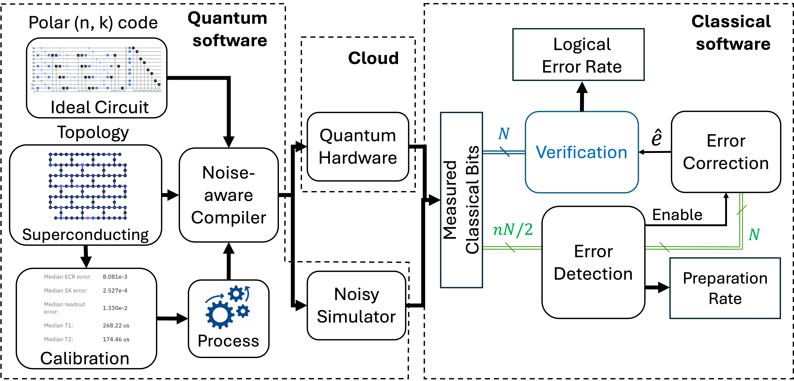
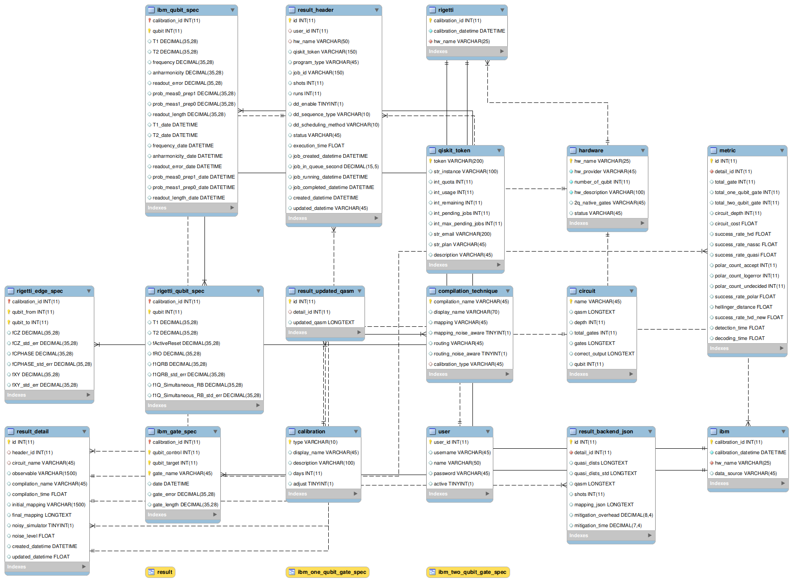

# Tutorials

The details part of the platform will be explained here.

In summary, we have xx parts:
1. Quantum Software
2. Classical Software
3. Cloud / Network
4. Database
5. Reporting Service

## Database

In our platform, we use relational database management system (RDBMS). It is one of the important parts because it helps to organize our research data which will be processed later.

In our project, we use `MariaDB` as it is compatible with the cloud virtual server (EC2) provided by Amazon Web Services (AWS). Below you can see the structure of our database

For detail tutorial for this part, you can see this jupyter notebook [file](5-database.ipynb).

