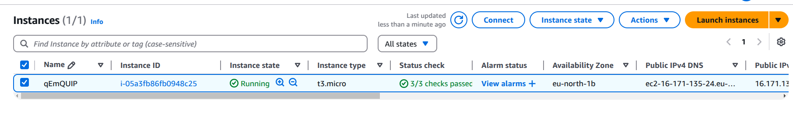

# Tutorials

The details part of the platform will be explained here.

In summary, we have 4 parts:
1. Quantum Software
2. Classical Software
3. Cloud / Network
4. Database

## Quantum Software

At this moment, we use [IBM Qiskit](https://www.ibm.com/quantum/qiskit) as our quantum software. Please see the documentation [here](https://docs.quantum.ibm.com/guides) for more detail.

For detail tutorial for this part and example how to use the platform, you can see this jupyter notebook [file](../tutorial.ipynb).

## Classical Software

The classical software is used to validate the result from the real quantum processor or the simulator. The detail of this process can be found in [here](../wrappers/polar_wrapper/)

## Cloud / Network

We employ the [virtual cloud server (EC2)](https://aws.amazon.com/es/ec2/) from AWS where we put our database and scheduler to retrieve the calibration data periodically.

Note: AWS EC2 service is free, but you need to register and make an account.

## Database

We use relational database management system (RDBMS). It is one of the important parts because it helps to organize our research data which will be processed later.

In our project, we use `MariaDB` as it is compatible with the cloud virtual server (EC2) provided by Amazon Web Services (AWS). Below you can see the structure of our database

For detail tutorial for this part, you can see this jupyter notebook [file](4-database.ipynb).

# Implementation

For the example of our implementation for state preparation of quantum error correction, you can see here: [Noise-aware Compilation for State Preparation of Quantum Polar Codes](https://github.com/HandyKurniawan/na_polar_codes_framework/)

